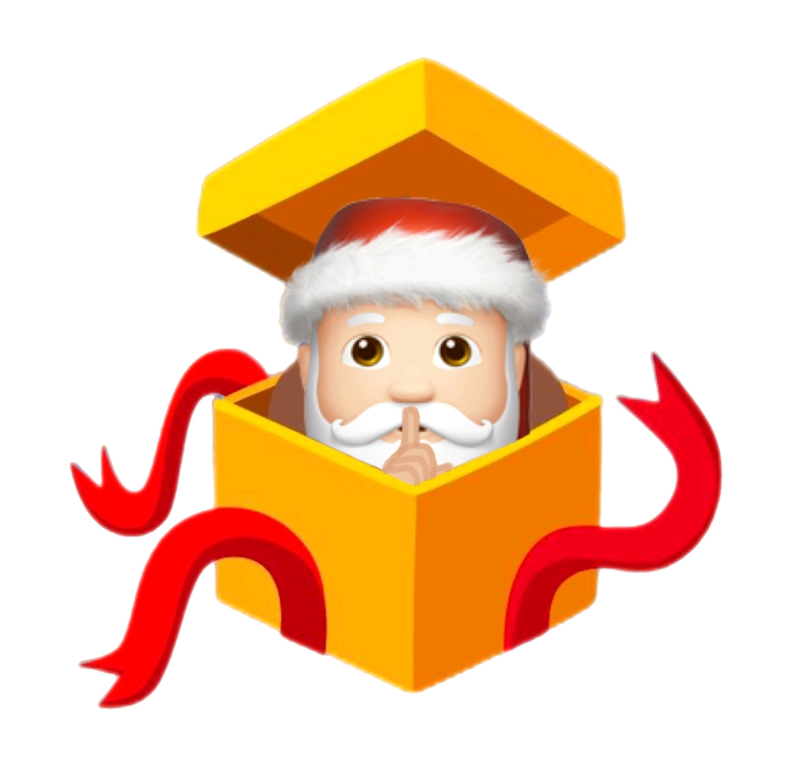

# Secret Santa Party App

Secret Santa Party ([@secretsantabot](https://t.me/santapartybot)) is the Telegram [Mini App](https://core.telegram.org/bots/webapps) which allows randomly assigned a person to whom they give a gift (popular worldwide [tradition](https://en.wikipedia.org/wiki/Secret_Santa)).

- [Overview](#overview)
- [Used technologies](#used-technologies-and-libraries)
- [Requirements](#requirements)
- [Installation](#installation)
- [Developing Telegram Mini App guide](#developing-telegram-mini-app-guide)

## Overview
Server side is a one-file express application which store data in JSON database and interact with Telegram Bot API.

Client side is a basic React single page application. Code architecture is described by [FSD](https://feature-sliced.design/) methodology. State manager is allows to describe application entities, simply managed them and monitor changes to update rendered content.
## Used technologies and libraries
### Common
- [dotenv, dotenv-cli](https://github.com/motdotla/dotenv/tree/master) loads environment variables from .env files,
- [localtunnel](https://theboroer.github.io/localtunnel-www/) allows easily share a web service on your local development machine.
### Server
- [node.js](https://nodejs.org/) run backend JavaScript,
- [nodemon](https://nodemon.io/) monitor for any changes in source and automatically restart server,
- [express](https://expressjs.com/), [cors](https://www.npmjs.com/package/cors), [body-parser](https://www.npmjs.com/package/body-parser) - libraries to run and configure http-server,
- [lowdb](https://github.com/typicode/lowdb) - simple to use local JSON database,
- [nanoid, nanoid-dictionary](https://github.com/ai/nanoid) - unique string ID generator,
- [node-telegram-bot-api](https://www.npmjs.com/package/node-telegram-bot-api) - module to interact with the Telegram Bot API.
### Client
- [Create React App](https://create-react-app.dev/) - utility which create react application by one command,
- [axios](https://axios-http.com/ru/docs/intro) - HTTP client,
- [lottie-react](https://lottiereact.com/) run lottie files,
- [mobx-state-tree](https://mobx-state-tree.js.org/intro/welcome) - reactive state management,
- [tailwindcss](https://tailwindcss.com/) - CSS framework.

## Requirements
- Node.js 16.x or higher
- macOS or Linux operating system (Windows is not checked)

## Installation
1. Clone the repository:

    `git clone https://github.com/stasovlas/secret-santa-tg.git`

2. Go to app dir:

    `cd secret-santa-tg`

3. Install:

    `npm run setup`

4. Setup environments (it can be configured at any time)

    Environments are described as env files:
   - `.env` - secret environment? copy it from `.env.example` and fill by your data
   - `.env.dev` - environment for local developing
   - `.env.tunnel` - environment for local developing too, but with exposing local machine to the internet
   - `.env.prod` - production environment

    Global variables you can setup:
   - `TELEGRAM_TOKEN` - Telegram bot token which you received after bot registration,
   - `TELEGRAM_WEB_APP` - url of web application,
   - `CLIENT_PORT` - port on which client application will run,
   - `SERVER_PORT` - port on which server application will run,
   - `REACT_APP_SERVER_HOST` - host to which requests from the client application will be sent (prefix `REACT_APP_` is [necessary](https://create-react-app.dev/docs/adding-custom-environment-variables/)),
   - `CLIENT_TUNNEL_SUBDOMAIN` - subdomain to generate client host tunnel (for example `ssanta` generate `ssanta.loca.lt`),
   - `SERVER_TUNNEL_SUBDOMAIN` - subdomain to generate server host tunnel (for example `ssanta` generate `ssanta.loca.lt`),
   - `REACT_APP_ENV` - variable to differentiate developing and production environment (prefix `REACT_APP_` is [necessary](https://create-react-app.dev/docs/adding-custom-environment-variables/)).

## Developing Telegram Mini App guide
### Step 1
Developing the app until you need Telegram integration and have the option to use fictitious data. Use command `npm run dev` to run both client and server apps and watch code changes.
### Step 2
After developing the main part of the app, you'll need to finalize it with Telegram integration.
To do this:
1. Expose your local machine with command `npm run tunnel`;
2. Create the test bot with [@BotFather](https://t.me/BotFather) using command `/newbot`, name it for example `SsantaFunTestBot` and then configure (optional) [menu button](https://core.telegram.org/bots/webapps#launching-mini-apps-from-the-menu-button) using URL from point 1;
3. Create the test app with [@BotFather](https://t.me/BotFather) using command `/newapp`:
   1. Select bot will be offering the web app (previously created),
   2. Enter something for title,
   3. Enter short description,
   4. Choose picture,
   5. Choose gif or not,
   6. Enter Web App URL (you can find it in console after run `npm run tunnel`), it should be `'https://' + CLIENT_TUNNEL_SUBDOMAIN + '.loca.lt'`, for example `https://ssanta.loca.lt`,
   7. Enter name, for example `app`,
   8. Click the link to your web app, it will be like `t.me/SsantaFunTestBot/app` - Telegram will open your app;
4. Now you can develop you app as usual but watch progress in Telegram.
### Step 3
After you finished developing to do this:
1. Host your application in internet using VPS, for example;
2. Configure `.env.prod` according point 1;
3. Create production bot like in Step 2;
4. Create production app like in Step 2, but use link to your web app according to point 1;